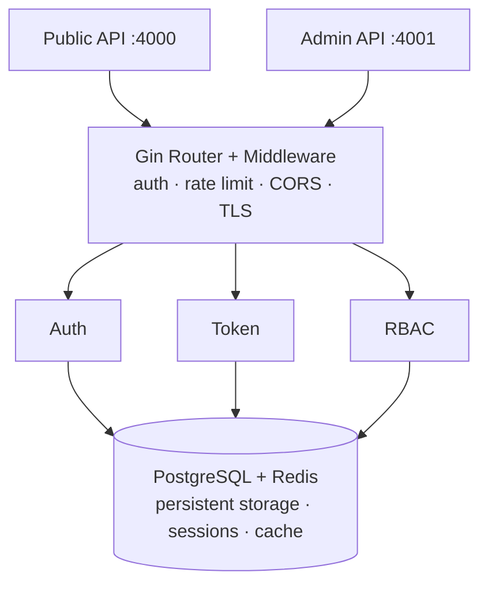

# Auth Service

[](https://go.dev)
[](./LICENSE)
[](https://pages.nist.gov/800-63-4/)

## About

Authentication and authorization service for the QuantFlow Studio ecosystem. Serves two client types: **Users** (humans) and **Systems** (services and AI agents). Built on OAuth 2.1 with mandatory PKCE, asymmetric JWT signing, and NIST SP 800-63-4 AAL2 compliance.

## Features

- **OAuth 2.1** — Authorization Code + PKCE, Client Credentials; no implicit or ROPC grants
- **Asymmetric JWT** — ES256 / EdDSA signing with JWKS endpoint
- **Dual Client Model** — Users (interactive) and Systems (machine-to-machine)
- **Argon2id Password Hashing** — 19 MiB memory, 2 iterations, HMAC pepper
- **NIST Password Policy** — 15-char minimum, breached-password blocklist, no composition rules
- **Token Security** — Prefixed tokens (`qf_at_`, `qf_rt_`, `qf_ac_`, `qf_ak_`), only signatures stored in DB
- **Dual-Port Architecture** — Public (:4000) and Admin (:4001) with network-level isolation
- **Rate Limiting** — Per-IP with progressive delay and account lockout
- **DPoP Support** — Demonstrating Proof-of-Possession token binding
- **MFA** — TOTP with backup codes
- **Social Login** — Google, GitHub, Apple OAuth providers
- **OIDC Provider** — OpenID Connect discovery and ID tokens
- **SAML SSO** — Service Provider integration
- **Multi-Tenancy** — Subdomain and header-based tenant resolution

## Quick Start

### Prerequisites

- Go 1.25+
- PostgreSQL 15+
- Redis 7+
- Docker & Docker Compose (optional)

### Run with Docker Compose

```bash
# Start all dependencies
docker-compose up -d

# Run migrations
go run cmd/migrate/main.go up

# Start the service
go run cmd/server/main.go
```

### Run locally

```bash
# Copy and edit environment variables
cp .env.example .env

# Start dependencies
docker-compose up -d postgres redis

# Run migrations
go run cmd/migrate/main.go up

# Start the service
source .env && go run cmd/server/main.go
```

## API Surface

| Method | Endpoint | Description |
|--------|----------|-------------|
| POST | `/auth/register` | Register a new user |
| POST | `/auth/login` | Authenticate and obtain tokens |
| POST | `/auth/token/refresh` | Refresh an access token |
| POST | `/auth/token/revoke` | Revoke a refresh token |
| POST | `/auth/password/reset` | Request password reset |
| POST | `/auth/password/reset/confirm` | Confirm password reset |
| GET | `/.well-known/jwks.json` | JSON Web Key Set |
| GET | `/.well-known/openid-configuration` | OIDC discovery document |
| POST | `/oauth/authorize` | OAuth 2.1 authorization |
| POST | `/oauth/token` | OAuth 2.1 token exchange |
| GET | `/admin/clients` | List OAuth clients (admin) |
| POST | `/admin/clients` | Create OAuth client (admin) |
| GET | `/health` | Health check |
| GET | `/ready` | Readiness probe |

Full API specification: [`api/`](./api/)

## Architecture



See [architecture diagrams](./.agent/system/architecture-diagrams.md) and [project architecture](./.agent/system/project-architecture.md) for details.

## Configuration

All configuration is via environment variables. See [`internal/config/config.go`](./internal/config/config.go) for the full source.

### Required Variables

| Variable | Description |
|----------|-------------|
| `APP_ENV` | Environment: `development`, `staging`, or `production` |
| `POSTGRES_HOST` | PostgreSQL host |
| `POSTGRES_DB` | PostgreSQL database name |
| `POSTGRES_USER` | PostgreSQL user |
| `POSTGRES_PASSWORD` | PostgreSQL password |
| `REDIS_HOST` | Redis host |
| `JWT_PRIVATE_KEY_PATH` | Path to JWT private key file |
| `SYSTEM_SECRETS` | Comma-separated secrets (newest first for rotation) |
| `PASSWORD_PEPPER` | HMAC pepper for Argon2id hashing |
| `CORS_ALLOWED_ORIGINS` | Comma-separated allowed CORS origins |

### Optional Variables

| Variable | Default | Description |
|----------|---------|-------------|
| `PUBLIC_PORT` | `4000` | Public API port |
| `ADMIN_PORT` | `4001` | Admin API port |
| `GRPC_PORT` | `4002` | gRPC port |
| `LOG_LEVEL` | `info` | Log level |
| `POSTGRES_PORT` | `5432` | PostgreSQL port |
| `POSTGRES_SSLMODE` | `disable` | PostgreSQL SSL mode |
| `POSTGRES_MAX_CONNS` | `10` | Maximum PostgreSQL connections |
| `REDIS_PORT` | `6379` | Redis port |
| `REDIS_PASSWORD` | _(empty)_ | Redis password |
| `REDIS_DB` | `0` | Redis database number |
| `JWT_ALGORITHM` | `ES256` | JWT signing algorithm (`ES256` or `EdDSA`) |
| `ACCESS_TOKEN_TTL` | `15m` | Access token lifetime |
| `REFRESH_TOKEN_TTL` | `7d` | Refresh token lifetime |
| `ARGON2_MEMORY` | `19456` | Argon2id memory in KiB |
| `ARGON2_TIME` | `2` | Argon2id iterations |
| `ARGON2_PARALLELISM` | `1` | Argon2id parallelism |
| `RATE_LIMIT_RPS` | `50` | Requests per second |
| `RATE_LIMIT_BURST` | `100` | Burst size |
| `RATE_LIMIT_PROGRESSIVE_DELAY_AFTER` | `5` | Failed attempts before progressive delay |
| `RATE_LIMIT_MAX_FAILED_ATTEMPTS` | `10` | Failed attempts before lockout |
| `RATE_LIMIT_LOCKOUT_DURATION` | `15m` | Lockout duration |
| `TLS_ENABLED` | `false` | Enable TLS |
| `CORS_ALLOWED_METHODS` | `GET,POST,PUT,PATCH,DELETE,OPTIONS` | Allowed HTTP methods |
| `CORS_ALLOWED_HEADERS` | `Authorization,Content-Type,X-Request-ID` | Allowed headers |
| `CORS_EXPOSE_HEADERS` | `X-Request-ID` | Exposed headers |
| `CORS_ALLOW_CREDENTIALS` | `false` | Allow credentials |
| `CORS_MAX_AGE` | `12h` | Preflight cache duration |
| `REQUEST_MAX_BODY_SIZE` | `1048576` | Max request body in bytes (1 MiB) |
| `REQUEST_TIMEOUT` | `30s` | Request timeout |
| `EMAIL_ENABLED` | `false` | Enable email delivery |
| `EMAIL_SERVICE_URL` | _(empty)_ | Email service base URL |
| `EMAIL_API_KEY` | _(empty)_ | Email service API key |
| `EMAIL_SENDER_ADDRESS` | _(empty)_ | From address for outgoing mail |
| `DPOP_ENABLED` | `false` | Enable DPoP proof binding |
| `DPOP_NONCE_TTL` | `5m` | DPoP nonce lifetime |
| `DPOP_JTI_WINDOW` | `1m` | DPoP replay window |
| `MFA_ISSUER` | `QuantFlow Studio` | TOTP issuer name |
| `MFA_DIGITS` | `6` | TOTP digits (6 or 8) |
| `MFA_PERIOD` | `30` | TOTP period in seconds |
| `MFA_BACKUP_CODE_COUNT` | `10` | Number of backup codes |
| `OIDC_ISSUER_URL` | `http://localhost:4000` | OIDC issuer URL |
| `OIDC_ID_TOKEN_TTL` | `1h` | ID token lifetime |
| `OIDC_SUPPORTED_SCOPES` | `openid,profile,email,offline_access` | Supported OIDC scopes |
| `SAML_ENABLED` | `false` | Enable SAML SSO |
| `TENANT_DEFAULT_ID` | _(empty)_ | Default tenant ID |
| `TENANT_RESOLUTION_MODE` | `both` | Tenant resolution: `subdomain`, `header`, or `both` |
| `TENANT_BASE_DOMAIN` | _(empty)_ | Base domain for subdomain parsing |
| `TENANT_CACHE_TTL` | `5m` | Tenant lookup cache TTL |

## Development

```bash
# Run all tests
go test ./...

# Run tests with race detection and coverage
go test -race -coverprofile=coverage.out ./...
go tool cover -html=coverage.out

# Format and lint
go fmt ./...
goimports -w .
golangci-lint run

# Build
go build -o bin/auth-service cmd/server/main.go
```

## Tech Stack

| Component | Technology |
|-----------|-----------|
| Language | Go 1.25+ |
| Framework | Gin |
| Database | PostgreSQL 15+ (pgx/v5) |
| Cache | Redis 7+ (go-redis/v9) |
| JWT | ES256 / EdDSA (lestrrat-go/jwx) |
| Password Hashing | Argon2id |
| Logging | zap |
| Container | Docker (multi-stage, Alpine, non-root) |

## Project Status

**v0.67.0 — feature-complete.** All three phases shipped:

- **Phase 1 — MVP**: Core auth, tokens, RBAC, middleware, storage
- **Phase 2 — Production**: MFA, WebAuthn, DPoP, social login, gRPC, OIDC provider, audit logging
- **Phase 3 — Enterprise**: Multi-tenancy, SAML SSO, webhooks, GDPR, agent credential broker

## Built with Pilot

This project is developed with [Pilot](https://github.com/alekspetrov/pilot) — an autonomous AI execution bot that implements GitHub issues, runs verification, and opens pull requests.

## Contributing

See [CONTRIBUTING.md](./CONTRIBUTING.md) for development setup, code style, and PR guidelines.

## License

This project is licensed under the MIT License. See [LICENSE](./LICENSE) for details.
